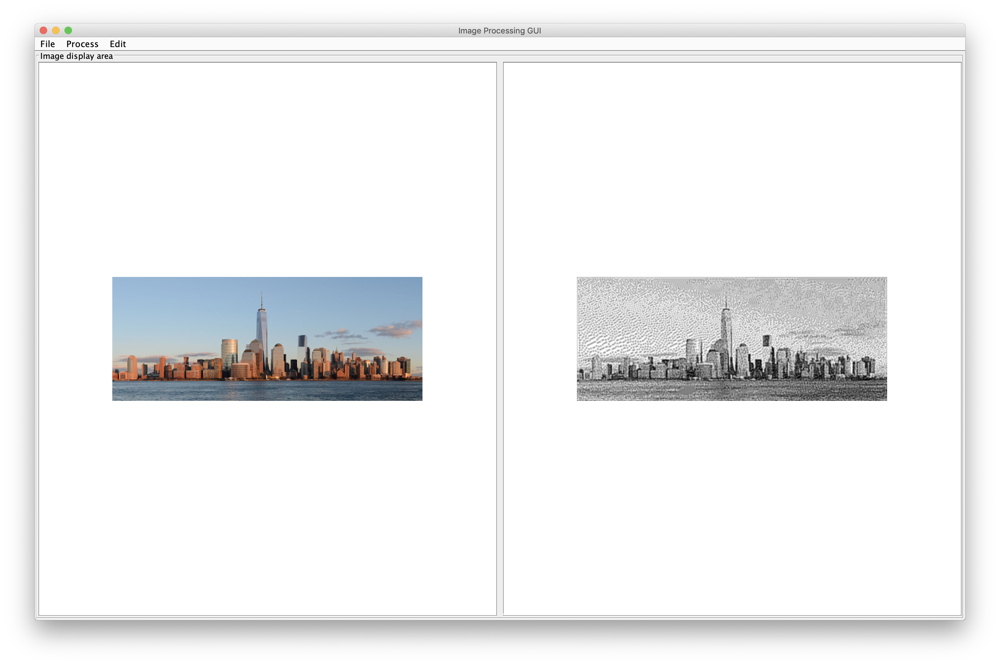

# Image Processing Program

Version 3.0

Image Processing Program is a program to apply various image processing operations on 24-bit images. 
It can also generate images with rainbow stripes and a checkerboard pattern, and create a 
national flag of a user-specified size, but of the prescribed proportions.

The program offers two modes–script mode and interactive mode for use. A user can either load, 
process and save images in the interactive mode which offers a graphical user interface, or
execute a script in the script mode to perform a batch of image operations.

## Features

The program delivers several features.  

1. Image processing operations: Blurring, sharpening, greyscale, sepia tone, dither and mosaic.

2. Image generation operations: Horizontal/vertical rainbow stripes, checkerboard pattern, 
flags of France, Greece and Switzerland.

3. Batch script support (script mode).

4. Graphic user interface support (interactive mode).

5. Redo and undo operations support in the interactive mode.

## Usage

The program (from IntelliJ or the JAR file) accepts two types of command-line inputs:

- `java -jar "Assignment 10.jar" -script path-of-script-file`: when invoked in this manner the 
program opens the script file, executes it and then shuts down.

- `java -jar "Assignment 10.jar" -interactive:` when invoked in this manner the program opens the 
graphical user interface.

Any other command-line arguments are invalid: in these cases the program will display an error 
message suitably and quit.

### Script mode

`path-of-script-file`: the path for the script file.

The script contains a batch of commands. In this mode, the program can suitably loads and saves 
images, apply various image processing operations on them, and also generates various images with 
different patterns, according to the script provided by the user. 

You can find some script example files and example images under `res/` folder of the project.

#### Script format

The script file is a plain `txt` file containing all the commands to be executed. 

A maximum of one command is allowed for each line. The command keywords (e.g. `load`) and its 
argument (e.g. `img.png`) should be separated by one or more white spaces. Any leading or trailing 
spaces will be automatically ignored. There should be no empty line between the commands.

#### Supported commands

##### Command syntax

Note: `OR` means choosing one of the available optional arguments.

1. `load OR save [file]`:

   - load or save an image from a file
   
   - `file`: the relative path to the image file

2. `greyscale OR blur OR sepiatone OR sharpen OR dither [file]`

   - `file`: the relative path to the image file

3. `mosaic [numberOfSeeds]`

   - create an image mosaic
   
   - `numberOfSeeds`: the number of seeds used to create mosaic (a positive integer)

4. `generate checkerboard [sizeOfSquares]`
  
   - generate a checker board image
   
   - `sizeOfSquares`: the size of squares on the checker board (a positive integer)

5. `generate flag [height] [width] [countryAlphaCode]`

   - generate a national flag image
   
   - `height`: the height of the image
   
   - `width`: the width of the image
   
   - `countryAlphaCode`: the [country alpha code](https://countrycode.org) for the country of which 
   the flag is to be generated

6. `generate rainbow [height] [width] v OR h`

   - generate a rainbow image
   
   - `height`: the height of the image
     
   - `width`: the width of the image
   
   - `v OR h`: `v` for vertical stripes, `h` for horizontal stripes

##### About the image file:

Supported formats: JPEG, WBMP, PNG, BMP, GIF.

The file uses relative or absolute path.

Note for relative path: *Do not precede the path with `/`.* If the program is run from IntelliJ, 
the file path is relative to the project folder; if the program is run from `jar` file, the file 
path is relative to the current folder (for example, if you run the `jar` file provided in `res/` 
folder of this project, a `load img.png` command will search for `img.png` within this folder to 
load). 

### Interactive mode

This mode will open a simple GUI program for a user to perform various supported image
operations. 

- The image display area of this program is split into two parts: left part is for original image 
loaded from a file, and right part is for the processed or generated image.

- All the operations can be done through the program menus.

    - File load/save and image generation operations are under the `File` menu.

    - Image processing related operations are under the `Process` menu.
    
    - Redo/undo and script execution operations are under the `Edit` menu.
    

#### About redo and undo

`Redo`: Redo the last undone image operation.

`Undo`: Undo the last image operation.

Redo and undo do not support file operations (i.e., save/load).

#### About script execution

`Edit - Script`: A user can enter a batch script in the pop-up dialog, and hit `run` button to
execute the script. The final result will be showed in the right display area.

The format of the script is the same as that in the script mode.

#### About file load/save

The supported file formats are: JPEG, WBMP, PNG, BMP, GIF.

When loading a file, a user can select the file filter to specify the type of file to load.
When saving a file, a user *must* enter the name of the file **and** append the file extension to 
save the image correctly.  

## Structure

`imageprocessing.controller`: the code for the controller

`imageprocessing.model`: the code for the model

`imageprocessing.operation`: the code for all image processing/generation operations

`imageprocessing.util`: the utility code for the program (File I/O)

`imageprocessing.view`: the code for the view

## Image Citations

Image 0 was downloaded from the 
[course website](https://course.ccs.neu.edu/cs5004/).

Image 1 and 2 were downloaded from [Pexels](https://www.pexels.com/) and can be used for free 
according to their terms of use.

Image 1: 
[By Rumples Grumples](https://www.pexels.com/photo/photo-of-tractor-on-fields-1033716/)

Image 2:
[By Peter de Vink](https://www.pexels.com/photo/photography-of-airplane-near-mountain-849534/)

## Disclaimer

This is a group project for CS5004 Object-Oriented Design and a Git repository was not used originally. For maintaining academic integrity, please do NOT reuse any code in this repository if you are working on your project for a related course.
